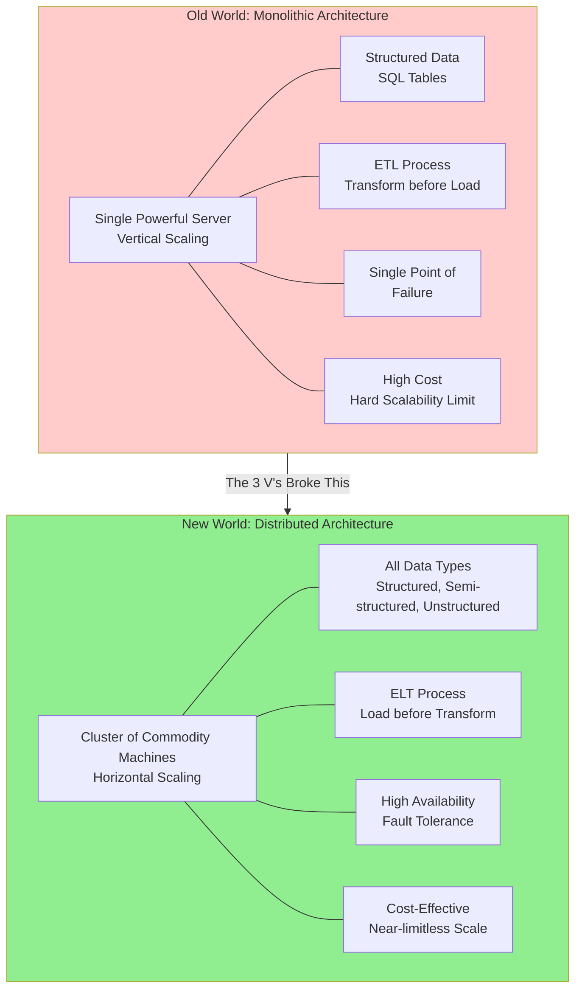

Imagine you start with a small notebook 📒 where you track your daily expenses. Easy, right? But what if suddenly you had to record **millions of transactions every second**, coming not just as numbers, but also in **texts, images, videos, and logs**? Your little notebook (database) wouldn’t survive.

This is the story of how **Apache Spark** was born — to handle the **explosion of big data** when traditional databases failed.

---

### 📌 Core Learning: The Data Revolution & The Rise of Spark

### **1. The Old World: Structured Data in Databases**

- Data was primarily **structured** (tabular), like Excel sheets or SQL tables.
- It was stored and processed in **monolithic systems** (single, powerful servers).
- **Example:** A customer orders table in a MySQL database with fixed columns like `order_id`, `customer_id`, and `amount`.

### **2. The Big Data Explosion: The Three V's**

The internet changed everything. Data exploded in:

- **Volume:** Terabytes and petabytes of data, not just gigabytes.
- **Variety:** Data came in multiple formats:
    - **Structured:** Traditional tables.
    - **Semi-Structured:** JSON, XML, YAML (flexible schema).
    - **Unstructured:** Images, videos, logs, text files (no fixed schema).
- **Velocity:** Data started flowing in at high speed—every second, minute, and hour.

This combination of the **3 V's** is what defines "Big Data." Traditional systems couldn't handle this trifecta.

### **3. The Architectural Shift: Monolithic vs. Distributed**

To solve this, two architectural approaches emerged:

| Monolithic Approach (Vertical Scaling) | Distributed Approach (Horizontal Scaling) |
| --- | --- |
| ➕ Add more power (CPU, RAM) to a single machine. | ➕ Add more commodity (cheap, standard) machines to a cluster. |
| ⚠️ **Expensive** and has a hard scalability limit. | ✅ **Cost-effective** and scales almost infinitely. |
| ⚠️ **Single point of failure;** the whole system crashes if one part fails. | ✅ **High availability;** if one machine fails, others take over. |

### **4. The Processing Paradigm Shift: ETL vs. ELT**

The data processing workflow also evolved to handle the load:

- **Old ETL (Extract, Transform, Load):** Transform data *before* loading it into a data warehouse. This was too slow for huge data volumes.
- **Modern ELT (Extract, Load, Transform):** Dump raw data into a cheap storage system (like a data lake) first. Transform it *later* as needed. This approach requires a powerful processing engine like Spark.

```python
# Spark is built for the ELT paradigm.
# 1. EXTRACT: Read raw, unstructured data from various sources.
raw_data = spark.read.text("s3://my-bucket/raw_logs/")

# 2. (optional) LOAD: Store it immediately if needed.
raw_data.write.parquet("s3://my-bucket/raw_data_parquet/")

# 3. TRANSFORM: Process and clean it later using Spark's power.
cleaned_data = raw_data.filter(raw_data.value.contains("ERROR"))
cleaned_data.show()

```

### 🔁 The Big Data Problem & The Distributed Solution

The following diagram illustrates the fundamental shift from a monolithic to a distributed architecture, which is the foundation Spark is built upon.



---

### 🎯 Career & Interview Edge

### **5 Essential Interview Questions**

**1. What are the 3 V's of Big Data?**

> Answer: Volume (scale of data), Velocity (speed of data in/out), and Variety (range of data types and sources). They describe the challenges that led to the development of distributed systems like Spark.
> 

**2. What is the difference between vertical and horizontal scaling?**

> Answer: Vertical scaling (scaling up) adds more power (CPU, RAM) to an existing single machine. Horizontal scaling (scaling out) adds more machines to a pool of resources. Spark is designed for horizontal scaling.
> 

**3. What is the difference between ETL and ELT?**

> Answer: ETL transforms data before loading it into a warehouse. ELT loads raw data first (e.g., into a data lake) and transforms it later. Spark is a key tool for the transform step in the modern ELT paradigm.
> 

**4. Why did traditional databases struggle with modern data?**

> Answer: They were designed for structured, tabular data and monolithic architecture. They couldn't handle the volume, variety, and velocity of modern semi-structured and unstructured data.
> 

**5. What is the main advantage of a distributed system?**

> Answer: The main advantages are near-limitless horizontal scalability, fault tolerance (if one node fails, the cluster survives), and cost-effectiveness (using commodity hardware).
> 

---

### ✅ Summary

- Apache Spark was invented to solve the **Big Data problem** defined by the **3 V's: Volume, Velocity, Variety**.
- It represents a shift from expensive, limited **monolithic** systems to flexible, powerful **distributed** systems.
- It enables the modern **ELT** paradigm, allowing us to store vast amounts of raw data and process it at scale.
- Understanding this **why** behind Spark is just as important as knowing how to use it.

---

Mastering Spark isn't just about learning a tool; it's about understanding the architectural revolution that made modern data science and engineering possible. This foundational knowledge is what sets senior engineers apart.

---

**Keep building, keep scaling!** 🚀

#ApacheSpark #BigData #DataEngineering #DistributedComputing #DataArchitecture #ELT #TechRevolution #CareerGrowth #LearnDataEngineering

**👉 P.S. What's the largest dataset you've worked with? Share your stories to the first big data challenge you faced in the comments! 👇**