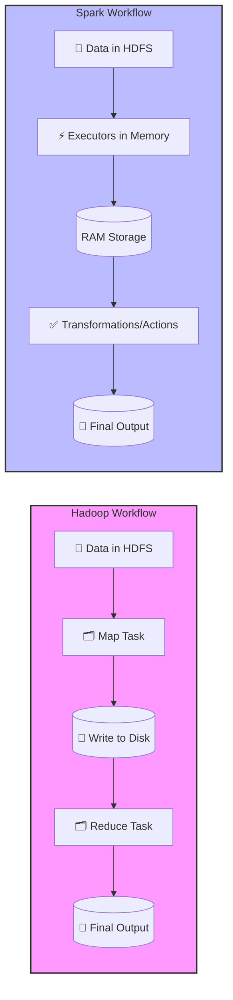

Imagine you’re at a **railway station**.

- Hadoop is like waiting for a **goods train** – reliable, can carry huge loads, but slow.
- Spark is like a **bullet train** – much faster, keeps things in memory, but needs more resources.

In today’s session, let’s break down the **real differences, myths, and career takeaways** between Hadoop and Spark 🔍

---

## 🔑 Common Misconceptions

- ❌ **Myth 1:** Hadoop is a database → No, it’s a **framework** with HDFS (file system) + MapReduce (processing).
- ❌ **Myth 2:** Spark is *always* 100x faster → Not always; typically 3x–5x faster, depending on the workload.
- ❌ **Myth 3:** Spark only uses RAM, Hadoop doesn’t → Both use RAM, but Hadoop constantly writes intermediate results to disk → slower.

---

## ⚡ Core Differences Between Hadoop & Spark

### 1️⃣ Performance

- **Hadoop**: Writes intermediate results to **disk** → slower.
- **Spark**: Keeps intermediate results in **memory** → faster.
- ⚠️ But if data already fits in one batch, performance difference may not be huge.

### 2️⃣ Processing Style

- Hadoop → Built for **batch processing**.
- Spark → Handles both **batch + real-time streaming** (ideal for modern use cases).

### 3️⃣ Ease of Use

- Hadoop MapReduce → Requires **complex coding**.
- Spark → High-level APIs in **Python, Java, Scala, R** → easier, developer-friendly.

### 4️⃣ Security

- Hadoop → Stronger security (Kerberos authentication, ACL-based authorization).
- Spark → Relies on underlying systems (e.g., HDFS security, Kerberos if integrated).

### 5️⃣ Fault Tolerance

- Hadoop → Replicates data across multiple nodes (e.g., 3 copies in HDFS).
- Spark → Uses **DAG lineage** → if a node fails, it recomputes lost data automatically.

---

## 🎨 Visual Flow – Hadoop vs Spark

👉 Notice: Hadoop repeatedly **writes to disk** (slower), while Spark keeps intermediate results in **memory** (faster).

---

## 🎯 Interview Edge – Q&A

**Q1. Is Hadoop a database?**

➡️ *No, Hadoop is a framework with HDFS (storage) + MapReduce (processing).*

**Q2. Why is Spark considered faster than Hadoop?**

➡️ *Because Spark stores intermediate results in memory, while Hadoop writes them to disk.*

**Q3. Can Spark handle real-time data?**

➡️ *Yes, Spark supports streaming, unlike Hadoop which is batch-only.*

**Q4. Which is more secure – Hadoop or Spark?**

➡️ *Hadoop, since it has built-in Kerberos authentication and ACL-based authorization.*

**Q5. How does Hadoop achieve fault tolerance?**

➡️ *By replicating data blocks across multiple nodes.*

**Q6. How does Spark recover from failures?**

➡️ *By using DAG lineage – it recomputes only the lost partitions.*

**Q7. Which is easier to code in – Hadoop or Spark?**

➡️ *Spark, because it provides high-level APIs in multiple languages.*

**Q8. Why was Hadoop initially designed to write everything to disk?**

➡️ *Because RAM was costly back then, and disk-based storage ensured reliability & sharing across processes.*

---

## ✨ Key Takeaways

- Hadoop = **Batch, reliable, secure**
- Spark = **Fast, flexible (batch + streaming), developer-friendly**
- Both ensure **fault tolerance**, but in different ways.
- In modern data engineering → Spark dominates due to speed + ease of use, while Hadoop still powers **large-scale storage + security-heavy systems**.

💡 If you’re aiming for a **career in Data Engineering**, knowing **both Spark & Hadoop** gives you a strong edge in interviews and real-world projects.

---

👉 What do you think – will **Spark completely replace Hadoop**, or will they continue to **co-exist in enterprise systems**?

---