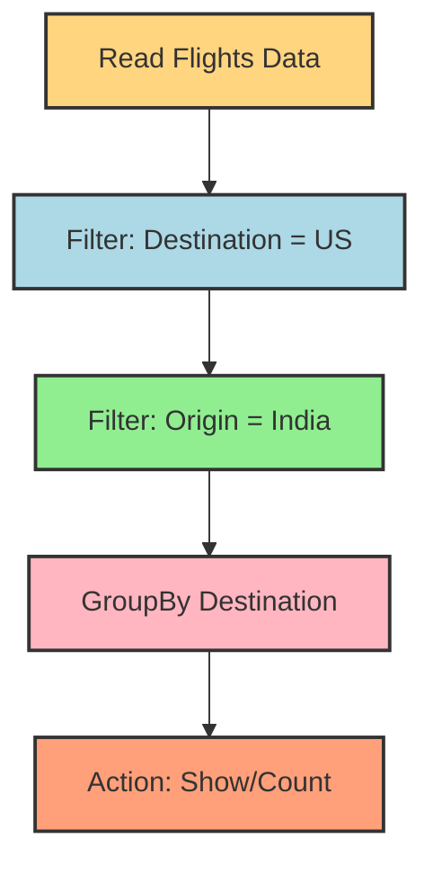

# 🚀 Spark DAG & Lazy Evaluation — The Secret Behind Spark’s Speed

Imagine you’re planning a road trip 🛣️. You list all possible stops, gas stations, and food breaks. But you don’t actually drive until the day of the trip. When you finally start, you don’t blindly follow your rough plan — you optimize it: skip unnecessary stops, reorder some tasks, and finish faster.

That’s exactly what Apache Spark does with **Transformations, Actions, DAGs, and Lazy Evaluation**. Let’s break it down 👇

---

## 🔑 Core Learning Notes

### 1. DAG (Directed Acyclic Graph)

- **Full form**: Directed Acyclic Graph
- **Directed** → Flow always goes forward (no loops).
- **Acyclic** → No cycles; you won’t get stuck repeating steps.
- **Graph** → A network of nodes (operations) connected by edges (data flow).

👉 In Spark, every job is represented as a DAG. Each transformation (filter, map, groupBy) adds a node to this DAG, and actions (count, show, collect) trigger execution.

---

### 2. Transformations vs Actions

- **Transformations**
    - Create a new dataset from an existing one.
    - Examples: `filter()`, `map()`, `groupBy()`.
    - **Lazy** → They don’t execute immediately.
- **Actions**
    - Trigger actual computation and return results.
    - Examples: `count()`, `show()`, `collect()`.
    - **Eager** → Execution starts when an action is called.

💡 **Why it matters in interviews**: If asked *“What triggers execution in Spark?”*, the answer is → **Actions**.

---

### 3. Lazy Evaluation

- Spark doesn’t execute transformations line-by-line.
- It **waits until an action is called**, then:
    1. Looks at the full chain of transformations.
    2. Optimizes the execution plan.
    3. Runs tasks in the most efficient way.

**Example:**

```python
df = spark.read.csv("flights.csv")
df1 = df.filter(df.destination == "US")
df2 = df1.filter(df.origin == "India")
df2.show()
```

- Nothing runs until `.show()` (the **action**) is called.
- Spark internally **combines the filters** into one optimized step → saves time.

---

### 4. Wide vs Narrow Dependencies

- **Narrow Dependency** → Each parent partition is used by **one child**.
    - Example: `filter()`, `map()`.
- **Wide Dependency** → Data must be shuffled across partitions.
    - Example: `groupBy()`, `join()`.

👉 This affects performance → wide transformations are costlier.

---

### 5. Spark UI (The Detective Tool 🕵️)

- Spark UI lets you **visualize DAGs, jobs, and stages**.
- Each **action = 1 job**.
- Jobs are broken into **stages**, and stages into **tasks**.
- Helpful for debugging and performance tuning.

---

## 🎨 Visual Learning — DAG & Lazy Evaluation



💡 Notice: Spark doesn’t run till groupBy immediately. It **waits till Show/Count (Action)**, then optimizes the whole path.

---

## 🎯 Interview Edge

### Common Questions & Sample Answers

1. **Q: What is a DAG in Spark?**
    - A DAG (Directed Acyclic Graph) is Spark’s execution plan, representing transformations as nodes and data flow as edges.
2. **Q: Why does Spark use Lazy Evaluation?**
    - To optimize execution → it combines transformations, removes redundancy, and reduces shuffling.
3. **Q: What’s the difference between Transformation and Action?**
    - Transformations define “what to do”, but Actions trigger “doing it”.
4. **Q: How many jobs are created in Spark?**
    - One job per action. If you call `count()` twice, Spark creates two jobs.
5. **Q: What are Wide vs Narrow transformations?**
    - Narrow = No shuffle (`map`, `filter`). Wide = Requires shuffle (`groupBy`, `join`).
6. **Q: What is Spark UI used for?**
    - To monitor jobs, stages, tasks, DAGs, and debug performance.

---

### ❌ Misconceptions to Avoid

- ❌ *“Transformations run immediately.”*
    - Nope! They wait until an action is triggered.
- ❌ *“Each transformation creates a job.”*
    - Wrong → Only actions create jobs.
- ❌ *“Wide dependency is faster than narrow.”*
    - Actually, **wide dependencies are slower** due to shuffling.

---

## 🔥 Summary

DAGs and Lazy Evaluation are Spark’s **secret weapons**. Instead of running code step-by-step, Spark waits, optimizes the plan, and executes efficiently. This makes big data processing **faster, smarter, and scalable**.

👉 Next time in an interview, explain Spark like a road trip: *“Transformations are the planned stops, Actions are the actual drive, and Lazy Evaluation is Spark’s way of waiting until the last moment to choose the best route.”* 🚗💨

---

💬 **Discussion Starter**:

Have you ever optimized Spark jobs by reordering transformations or reducing actions? What performance improvements did you notice?