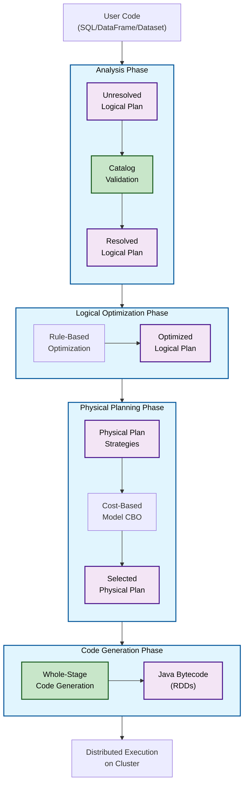

# From Spark Code to Java Bytecode: The Magic of the Catalyst Optimizer

Ever written a Spark SQL query and wondered how it magically turns into efficient, distributed Java code running on thousands of machines? It's not magic—it's the **Spark SQL Engine**! Think of it like a master chef (Spark) who takes your simple recipe (your code). Instead of blindly following it, the chef's smart assistant (the Catalyst Optimizer) analyzes it, swaps ingredients for better ones (optimizations), and creates a hyper-efficient game plan (physical plan) for a team of cooks (executors) to execute in perfect harmony, saving time and resources.

---

## 🧠 Core Learning Notes: The 4 Phases of Spark SQL Engine

The Catalyst Optimizer, the brain of the Spark SQL Engine, processes your code in four distinct phases to generate an optimal execution plan.

### 1. Analysis Phase

- **Goal:** Convert your user code into an **Unresolved Logical Plan**.
- **What happens?** Spark parses your SQL/DataFrame/Dataset code to understand the *intent* (e.g., `SELECT`, `FILTER`, `JOIN`). However, it hasn't verified if the tables or columns you referenced actually exist yet. This initial plan is "unresolved."
- **Why it matters?** This is where **`AnalysisException`** errors come from! Spark checks its **Catalog** (a metadata store holding info about databases, tables, columns, and files) to resolve column names, data types, and table sources.
- **Example:** If you write `df.select("name1")` but the actual column is `name`, Spark consults the catalog, fails to find `"name1"`, and throws an `AnalysisException` in this phase.

### 2. Logical Optimization Phase

- **Goal:** Transform the resolved Logical Plan into an **Optimized Logical Plan**.
- **What happens?** Spark applies rule-based optimizations to the plan. It simplifies and improves the logic *without* considering how it will run on the cluster.
- **Key Techniques:**
    - **Predicate Pushdown:** Pushing filters (`WHERE` clauses) closer to the data source to reduce the amount of data read.
    - **Projection Pruning:** Reading only the columns that are necessary for the final result, even if you wrote `SELECT *`.
- **Real-world Case:** If your code has multiple `.filter()` transformations, the optimizer will often combine them into a single filter operation for efficiency. This is a core part of **Lazy Evaluation**—optimizing before execution.

### 3. Physical Planning Phase

- **Goal:** Convert the optimized Logical Plan into one or more **Physical Plans**.
- **What happens?** Spark now thinks about the *how*. It translates the logical operations into physical algorithms that will run on the cluster.
- **Key Activities:**
    - **Algorithm Selection:** Deciding the best way to perform operations (e.g., for a `JOIN`, should it use a `BroadcastHashJoin` or a `SortMergeJoin`?).
    - **Cost-Based Optimization (CBO):** Spark evaluates different physical strategies and estimates their cost (CPU, memory, I/O) to choose the most efficient one.
- **Interview Edge:** "Spark Plan" is just another name for the Physical Plan.

### 4. Code Generation Phase (Whole-Stage Code Generation)

- **Goal:** Translate the selected Physical Plan into **Java Bytecode**.
- **What happens?** This is where the magic finally happens. Spark generates efficient, custom Java bytecode (which you can think of as the RDD transformations) that will be distributed and executed across the cluster's JVMs.
- **Why it's a big deal?** This phase collapses entire query stages into a single optimized function, significantly improving performance by reducing virtual function calls and leveraging CPU efficiency.

---

## 📊 Visual Learning: The Catalyst Optimizer Workflow

The following Mermaid.js diagram illustrates the end-to-end flow of how your code is processed:

---

## ⚡ Interview Edge: Questions & Answers

**1. What is the Catalyst Optimizer, and how does it work?**

> It's the core optimization engine in Spark SQL. It works in four phases: Analysis, Logical Optimization, Physical Planning, and Code Generation. It takes a declarative query, validates it, optimizes it logically, picks the best physical execution strategy, and finally generates highly efficient JVM bytecode.
> 

**2. What causes an `AnalysisException` and how do you resolve it?**

> It occurs in the Analysis Phase when Spark can't resolve column, table, or function names using the Catalog. To resolve it, check for typos in names, verify the data source path exists, and ensure the correct data types are used.
> 

**3. What is the difference between a Logical Plan and a Physical Plan?**

> The Logical Plan describes what the query should do (the operations). The Physical Plan describes how to do it on the cluster (the specific algorithms and execution strategies).
> 

**4. Is the Spark SQL Engine a compiler?**

> Yes, it's a query compiler. It compiles declarative DataFrame/SQL/Dataset code into imperative RDD transformations and Java bytecode, rather than interpreting it line-by-line.
> 

**5. How does Catalyst optimize a query with `SELECT *` followed by a filter on specific columns?**

> It uses Projection Pruning. During Logical Optimization, it realizes only a subset of columns are needed. It rewrites the plan to read only those specific columns from the source, drastically reducing I/O.
> 

**Common Misconception: "Lazy Evaluation means Spark does nothing."**

> Clarification: Lazy Evaluation means Spark defers execution until an action is called. During this "lazy" period, it's actually extremely active—building and optimizing the entire execution plan (DAG) under the hood, which is the key to its performance.
> 

---

## ✨ Summary

The **Spark SQL Engine** is like a smart translator – it doesn’t just translate, it **restructures your query** into the fastest, most resource-efficient form before execution. Understanding its **4 phases (Analysis → Logical Optimization → Physical Planning → Codegen)** makes you stand out in interviews and helps debug real-world Spark jobs.

💡 Next time you hit an **AnalysisException** or see Spark choosing a Broadcast Join, you’ll know exactly what’s happening under the hood.

---

👉 **Your Turn:**

Have you ever debugged a Spark job where changing a join strategy or filter order made it 10x faster? How did you figure it out?