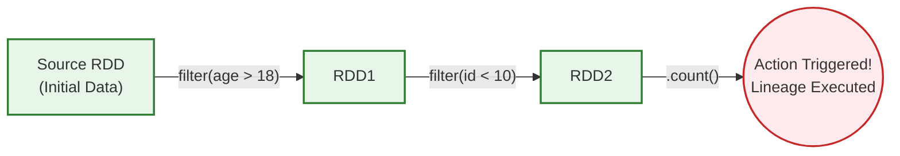

# 🚀 RDDs in Spark – The Backbone You Rarely See, But Always Rely On

Imagine you’re managing a library. Instead of storing all books in one room (like a list in memory), you distribute them across multiple branches in a city. Each branch knows which books it holds, and if one branch loses books in a fire, you can rebuild them because you know their source.

That’s exactly what **RDD (Resilient Distributed Dataset)** is for **Apache Spark** — a way to handle huge data across clusters reliably, efficiently, and with recovery built-in. Let’s break this down into interview-ready notes.

---

## 📌 Core Learning Notes

### 1. **What is an RDD?**

- **Full form:** Resilient Distributed Dataset
- **Definition:** A fundamental Spark data structure that stores data across a cluster in partitions.
- **Analogy:** Like splitting a big list into chunks and distributing across multiple computers.

**Key Traits:**

- **Resilient:** Fault-tolerant; rebuilds lost data using lineage (history of transformations).
- **Distributed:** Data is split into partitions across multiple nodes.
- **Immutable:** Once created, it cannot be changed. Transformations create new RDDs.

---

### 2. **How RDD Works (with an Example)**

- Start with a list: `[5, 6, 10, 2, 7, 8]`
- Store it across 4 partitions → distributed across cluster machines.
- Transformations (e.g., filter, map) create **new RDDs** without modifying the old ones.

Example:

```python
# Initial RDD
rdd = sc.parallelize([5, 6, 10, 2, 7, 8])

# Transformation: keep only even numbers
rdd1 = rdd.filter(lambda x: x % 2 == 0)

# Another Transformation: keep numbers < 10
rdd2 = rdd1.filter(lambda x: x < 10)

# Action: collect results
print(rdd2.collect())  # Output: [6, 2, 8]

```

---

### 3. **Features of RDD**

- ✅ **Fault tolerance:** Can recover lost partitions using lineage.
- ✅ **Immutability:** Ensures consistency; every change creates a new RDD.
- ✅ **Lazy evaluation:** Transformations don’t execute until an action is triggered → optimization possible.
- ✅ **Type-safety:** Compile-time error detection in strongly typed languages.

---

### 4. **When to Use RDDs**

- Handling **unstructured data** (e.g., text logs, images).
- When you need **full control** of transformations and logic.
- For **low-level transformations** not supported by DataFrames or SQL.

---

### 5. **Why Not Use RDDs? (Disadvantages)**

- ❌ **No automatic optimization:** Unlike DataFrames/SQL, Spark doesn’t optimize RDD execution plans.
- ❌ **Verbose & complex code:** Writing transformations manually is harder to read & maintain.
- ❌ **Performance cost:** Without optimization, operations can be slower.
- ❌ **Not analyst-friendly:** Only developers can handle RDD-based code.

👉 Instead, prefer **DataFrames & Datasets** for structured/semi-structured data → they allow Spark to optimize queries (Catalyst Optimizer).

---

## Visualizing RDD Lineage & Immutability

The following diagram shows how transformations on immutable RDDs build a lineage graph (a DAG), which is the key to fault tolerance.



---

## ⚡ Interview Edge: Questions & Answers

**1. What is an RDD?**

> It's Spark's core distributed, fault-tolerant data structure. Data is split into partitions processed in parallel across a cluster. Its key features are Resiliency (recovery via lineage), Distribution, and Immutability (transformations create new RDDs).
> 

**2. Why is immutability important for RDDs?**

> Immutability is crucial for fault tolerance. Since original RDDs are never altered, Spark can always recompute lost partitions by replaying the sequence of transformations (the lineage) from the original source data.
> 

**3. When should you use an RDD vs. a DataFrame?**

> Use an RDD when you need low-level control, are working with unstructured data (e.g., text, media), or require compile-time type safety.
Use a DataFrame for structured/semi-structured data. Spark's Catalyst Optimizer will automatically handle optimizations (e.g., predicate pushdown), and the code is more concise and readable.
> 

**4. What is lineage?**

> Lineage is the directed acyclic graph (DAG) of operations used to build an RDD. It's the recipe Spark uses to reconstruct lost data, making RDDs fault-tolerant. It's built lazily during transformations and only executed when an action is called.
> 

**5. What are the disadvantages of using RDDs?**

> No Built-in Optimization: Spark doesn't optimize RDD code automatically. The engine executes your exact instructions ("how to do it"), which can be less efficient than DataFrame's declarative approach ("what to do").Verbose Code: Operations like grouping and aggregation require more complex, low-level code compared to DataFrames' simple SQL-like syntax.Performance Overheads: Processing raw objects can be slower than the optimized internal formats (Tungsten) used by DataFrames.
> 

**Common Misconception: "RDDs are outdated and should never be used."**

> Clarification: While DataFrames/Datasets are the preferred API for most use cases due to their optimizations, RDDs are still vital for scenarios requiring fine-grained control, custom processing, or working with unstructured data that doesn't fit a tabular schema.
> 

---

## ✅ Summary

RDDs are the resilient, distributed backbone of Spark. Remember their three pillars: **Distribution** for scale, **Immutability** for safety, and **Resiliency** for fault tolerance. While you might often use the higher-level DataFrame API for its simplicity and speed, understanding RDDs is key to mastering Spark's core mechanics and tackling advanced problems in interviews and real-world projects.

---

**💬 Discussion CTA:**

**When was the last time you had to drop down to the RDD level for a task instead of using DataFrames? What was your use case?** Was it for unstructured data, a custom partitioner, or something else? Share your experience in the comments!

#BigData #ApacheSpark #RDD #DataEngineering #Interviews #LearningNotes #DataScience #CareerGrowth