 Ever tried to start a car without turning on the ignition? No matter how powerful the engine is, nothing happens. In the world of Apache Spark, the **SparkSession** is that ignition key! It's the single entry point that brings your code to life on a distributed cluster. Let's break down what it is and why it's the first thing you set up.

---

## 🧠 Core Learning Notes

### 1. What is a SparkSession?

Think of a SparkSession as your **"Main Method" for the entire Spark cluster**. Just as a Java program starts executing from `public static void main(String[] args)`, your Spark application starts from the SparkSession.

- **It's Your Application's Control Center:** It's the object that communicates with the cluster manager to request resources (CPU, memory) for your application.
- **The Unified Entry Point:** Before Spark 2.0, you needed separate entry points for different APIs (SparkContext, SQLContext, etc.). Now, the SparkSession seamlessly unifies them all.
- **It Holds Configuration:** You use the SparkSession builder (`SparkSession.builder()`) to specify your application's name, how much memory it needs, how many executors, etc.

**Why it matters for interviews:** This is a fundamental, must-know concept. Interviewers use this to gauge your basic understanding of how a Spark application is structured and initialized

---

### 2. SparkSession vs. SparkContext

| Feature | Spark Session | Spark Context |
| --- | --- | --- |
| Purpose | Entry point for all Spark functionalities | Manages cluster & execution |
| Introduced | Spark 2.0 | Spark 1.x |
| Handles | DataFrames, Datasets, Configurations | RDDs, job scheduling |
| Dependency | Creates SparkContext internally | Works standalone in Spark 1.x |

**Analogy:** Think of `SparkContext` as the engine of a car, and `SparkSession` as the dashboard with a key ignition, steering wheel, and all the controls to actually drive it.

---

### 3. How to Create a SparkSession

Here’s a simple code snippet to create a SparkSession in a local environment, just like in the transcript.

```python
# Line 1: Import the SparkSession module
from pyspark.sql import SparkSession

# Lines 2-5: Use the Builder pattern to create your session
spark = SparkSession.builder \\
    .master("local") \\         # Connect to the local machine (for testing)
    .appName("Testing") \\      # Name your application
    .config("spark.driver.memory", "12g") \\  # Request 12GB of driver memory
    .getOrCreate()             # Get the existing session or create a new one

# Now you can use 'spark' to read data and perform operations!
print(spark)

# You can also access the underlying SparkContext if needed
sc = spark.sparkContext
print(sc)

```

---

## 🔍 The SparkSession Workflow

The following diagram illustrates the journey your code takes once you create a SparkSession.

```mermaid
flowchart TD
    A[Your Code:<br>SparkSession.builder.getOrCreate] --> B[SparkSession Created]

    B --> C[Spark context Requests Resources from<br>Cluster Manager<br>e.g., YARN, Kubernetes]

    C --> D{Cluster Manager<br>Approves Request?}

    D -- Yes --> E[Allocates Resources:<br>- Driver<br>- Executors on Worker Nodes]

    E --> F[SparkSession becomes<br>Operational Entry Point]

    F --> G[You run operations:<br>spark.read.csv, df.filter, etc.]

    D -- No --> H[❌ Application Fails<br>Insufficient Resources]

    G --> I[✅ Job Executes on Cluster]

    style A fill:#90ee90
    style F fill:#ffcccb
    style I fill:#90ee90

```



---

## 🎯 Interview Edge

### Common Interview Questions

1. **What is a SparkSession?**
    - **Sample Answer:** It is the unified entry point to all Spark functionality and APIs (DataFrame, Dataset, SQL) starting from Spark 2.0. It encapsulates the `SparkContext` and is used to configure and run jobs on a cluster.
2. **What is the difference between SparkSession and SparkContext?**
    - **Sample Answer:** `SparkContext` was the original entry point for RDDs in Spark 1.x. `SparkSession` is a higher-level, unified entry point introduced in Spark 2.0 that includes `SparkContext`, `SQLContext`, `HiveContext`, and more, providing a single interface for all data processing tasks.
3. **How do you create a SparkSession?**
    - **Sample Answer:** Using the builder pattern: `SparkSession.builder.master("url").appName("name").config("key", "value").getOrCreate()`. This allows you to specify the cluster manager, application name, and various configurations.
4. **In Databricks, do you need to create a SparkSession explicitly?**
    - **Sample Answer:** No. Databricks runtime automatically creates a default `SparkSession` object named `spark`. This is why we can directly use `spark.read.csv()` without any setup.
5. **What is the purpose of the `.config()` method when building a SparkSession?**
    - **Sample Answer:** The `.config()` method is used to set Spark configuration properties for the application, such as the amount of driver memory (`spark.driver.memory`), the number of executor cores, or any other cluster resource requirements.

---

### Common Misconceptions

- **Misconception:** `SparkSession` and `SparkContext` are the same thing.
    - **Clarification:** A `SparkSession` *contains* a `SparkContext`. You can access it via `spark.sparkContext`. The `SparkSession` is a superset of the old context APIs.
- **Misconception:** You always have to manually create a `SparkSession`.
    - **Clarification:** In managed environments like Databricks, a `spark` session is created for you. You only need to build one explicitly in standalone applications or when you need a separate session with different configurations.

---

## ✨ Summary

- **SparkSession = Entry Point** (introduced in Spark 2.0).
- **SparkContext = Execution Engine** (still exists, created internally).
- Every Spark job → starts with SparkSession → configures resources → SparkContext communicates with the cluster → executes job.

💡 If you can explain SparkSession vs SparkContext clearly, you’ll handle 80% of Spark interview starters with confidence.

---

👉 **Your Turn:** Have you ever worked on a project where you had to tweak Spark configurations (`.config`) for performance? What was your approach?

#ApacheSpark #DataEngineering #BigData #InterviewPrep #LearningNotes #TechInterview #DataScience #SparkSession