# ⚡ Spark Application, Job, Stage & Task — Cracking the Most Asked Interview Question

Imagine you’re baking a cake 🍰.

- **Application** = deciding you’ll bake a cake.
- **Job** = baking different layers.
- **Stage** = breaking each layer into steps (mix → bake → cool).
- **Task** = actually mixing flour, cracking eggs, or putting it in the oven.

That’s exactly how Spark runs your code! This breakdown is one of the **top interview favorites** in Data Engineering & Big Data roles.

---

## 📘 Core Learning Notes

### 1. Spark Application

- Created when you run a Spark program via `spark-submit`.
- One `spark-submit` → one **Application**.
- Can contain multiple jobs depending on the **actions** inside the code.

---

### 2. Spark Job

- Triggered **only when an action is executed** (e.g., `.collect()`, `.count()`, `.show()`).
- If you have 5 actions → you’ll get **5 jobs**.
- Each job = one complete unit of execution.

📌 Example:

```python
df = spark.read.csv("data.csv")   # Action → Job 1
df.collect()                      # Action → Job 2

```

---

### 3. Spark Stage

- Each job is divided into **stages**.
- **Rule:** A new stage is created whenever there’s a **wide dependency transformation** (like `groupBy`, `join`, `repartition`) → because data needs to shuffle between partitions.
- **Narrow transformations** (like `map`, `filter`, `select`) stay in the same stage.

👉 So, stages = logical breakdown of a job.

---

### 4. Spark Task

- The **smallest unit of execution**.
- Runs on a **single partition** of data inside an executor.
- Number of tasks = number of partitions in a stage.

📌 Example:

- 1 partition → 1 task
- 200 partitions → 200 tasks

---

### 5. Example Workflow

Let’s say:

```python
df = spark.read.csv("data.csv")      # Action → Job 1
df = df.repartition(2)               # Wide → New stage
df = df.filter("age > 30")           # Narrow → Same stage
df = df.select("name", "age")        # Narrow → Same stage
df.groupBy("age").count().collect()  # Wide + Action → New Job, new stage

```

- Jobs created = **2** (`read`, `collect`)
- Stages created = **4**
- Tasks created = **203** (depending on partitions)

---

## 🎨 Visual Learning (Mermaid Diagram)

```mermaid
flowchart TD
    A[🚀 Spark Application] --> B["💼 Job 1 (read.csv)"]
    A --> C["💼 Job 2 (groupBy + collect)"]

    B --> B1[🗂 Stage 1]
    B1 --> T1[🔹 Task per partition]

    C --> C1[🗂 Stage 1: Repartition]
    C1 --> C2[🗂 Stage 2: Filter + Select]
    C2 --> C3[🗂 Stage 3: GroupBy Shuffle]
    C3 --> T200[🔹 200 Tasks]

```



✨ Easy rule to remember:

- **1 Application → multiple Jobs**
- **1 Job → multiple Stages**
- **1 Stage → multiple Tasks**

---

## 🎤 Interview Edge

### ✅ Frequently Asked Questions

1. **What is a Spark Application?**
    - A complete Spark program submitted via `spark-submit`.
2. **When is a Job created in Spark?**
    - When an action is triggered (e.g., `.collect()`, `.count()`).
3. **How are Stages determined?**
    - By transformations. Narrow transformations stay in the same stage; wide transformations create new stages.
4. **What is the smallest unit of work in Spark?**
    - A Task, which runs on a single partition of data.
5. **How many tasks will run in a stage?**
    - Equal to the number of partitions in that stage.
6. **What is the difference between narrow and wide transformations?**
    - Narrow → Data doesn’t move across partitions (e.g., filter).
    - Wide → Requires shuffle of data across partitions (e.g., groupBy, join).
7. **Minimum number of job/stage/task that can be created?**
    - Every job has **at least 1 stage**, and every stage has **at least 1 task**.

---

### ❌ Common Misconceptions

- **Misconception:** Every transformation creates a job.
    
    ✅ Correction: Only actions create jobs; transformations build the logical plan.
    
- **Misconception:** Number of tasks = number of stages.
    
    ✅ Correction: Tasks depend on **partitions**, not stages.
    
- **Misconception:** Spark always creates many tasks.
    
    ✅ Correction: A stage with 1 partition can have just 1 task.
    

---

## ✨ Summary

- **Application → Job → Stage → Task** is Spark’s execution hierarchy.
- **Actions create jobs**; **wide transformations create stages**; **partitions decide tasks**.
- In interviews, always explain with **real-life analogies + examples** → that’s what makes you stand out.

💡 Remember: If you can explain this hierarchy with clarity, you’ll impress any interviewer and show deep Spark understanding.

---

👉 **Your Turn:** How do you usually explain the difference between a **Job** and a **Stage** in Spark during interviews?

---

#ApacheSpark #BigData #DataEngineering #PySpark #InterviewPreparation #LearningNotes