# ⚖️ Spark Partitioning: `repartition()` vs. `coalesce()` - When to Use Which?

Imagine your data is a pile of books to be moved. Some boxes (partitions) are overloaded and heavy, while others are almost empty. The move is delayed because everyone waits for the one person struggling with the heaviest box. Spark faces the same issue: **data skew**. `repartition()` and `coalesce()` are your two tools to efficiently re-box these books, balancing the load to make the move faster and cheaper. Choosing the wrong tool can cost you time and resources!

---

## 📘 Core Learning Notes

### 1. Why Do We Need Repartition & Coalesce?

- Spark splits data into **partitions** (chunks).
- If partitions are **uneven** (some very small, some huge), processing becomes slow:
    - Small partitions finish quickly, leaving executors idle.
    - Large partitions delay the whole job.
- **Solution** → Balance or merge partitions using **repartition** or **coalesce**.

---

### 2. Repartition in Spark

- **Definition**: Completely reshuffles data into new partitions.
- **Key Features**:
    - Involves **shuffle** (expensive operation).
    - Produces **evenly distributed partitions**.
    - Can **increase or decrease** the number of partitions.
- 📌 Example:
    
    ```python
    df_re = df.repartition(5)   # Data is redistributed evenly into 5 partitions
    ```
    

---

### 3. Coalesce in Spark

- **Definition**: Reduces partitions by merging them (no shuffle).
- **Key Features**:
    - **No shuffle** → cheaper & faster.
    - Partitions remain **unevenly distributed**.
    - Can **only decrease** the number of partitions.
- 📌 Example:
    
    ```python
    df_co = df.coalesce(3)   # Merges into 3 partitions, no redistribution
    ```
    

---

### 4. Side-by-Side Difference

| Feature | **Repartition** | **Coalesce** |
| --- | --- | --- |
| Shuffle required? | ✅ Yes | ❌ No |
| Distribution | Even | Uneven |
| Increase partitions? | ✅ Yes | ❌ No |
| Performance cost | High (expensive) | Low (cheap) |
| When to use? | For balancing & scaling | For quick merging |

---

### 5. Real-World Scenario

- After a **join** on product sales:
    - Popular products create **skewed partitions** (100s of MB in one partition vs 10 MB in others).
- **Fix**:
    - Use **`repartition()`** to evenly distribute data.
    - Use **`coalesce()`** if you just want fewer partitions to save resources after filtering

---

### Visualizing the Difference

The following diagram illustrates the fundamental difference in how these two operations handle your data.

```mermaid
flowchart TD
    A[📂 Original Data] --> B["🔀 Repartition(5)"]
    A --> C["🗂️ Coalesce(3)"]

    B --> B1[📦 Partition 1: ~40MB]
    B --> B2[📦 Partition 2: ~40MB]
    B --> B3[📦 Partition 3: ~40MB]
    B --> B4[📦 Partition 4: ~40MB]
    B --> B5[📦 Partition 5: ~40MB]

    C --> C1[📦 Partition 1: 100MB]
    C --> C2[📦 Partition 2: 70MB]
    C --> C3[📦 Partition 3: 30MB]

style B fill:#f9f,stroke:#333,stroke-width:2px
style C fill:#bbf,stroke:#333,stroke-width:2px

```



---

## ⚡ Interview Edge: Questions & Answers

**1. What is the difference between `repartition()` and `coalesce()`?**

> repartition() does a full shuffle to create a new set of partitions, which can either increase or decrease their count and results in even data distribution. coalesce() merges existing partitions to only decrease the count, avoids a full shuffle, but can result in uneven data distribution.
> 

**2. When would you choose `coalesce()` over `repartition()`?**

> Use coalesce() when you need to reduce the number of partitions without the cost of a shuffle (e.g., after a filter that has drastically reduced data size). It's faster and more efficient for this specific purpose.
> 

**3. When is `repartition()` necessary?**

> Use repartition() when you need to increase the number of partitions or when you need to balance severely skewed data for downstream operations (like joins or aggregations) to prevent performance bottlenecks.
> 

**4. Can `coalesce()` ever cause a shuffle?**

> Yes, but rarely. coalesce() avoids a full shuffle by merging partitions on the same node. However, if you request to coalesce to a number fewer than the number of executor nodes, it may still need to shuffle data to move partitions around, but it's still more efficient than a full repartition().
> 

**5. How do you decide the optimal number of partitions?**

> There's no universal number. It requires trial and error based on your data size and cluster resources. The goal is to find a number where each partition is a manageable size (e.g., ~100-200MB) to maximize parallelism without the overhead of too many small tasks. A common starting point is (total data size / 128MB).
> 

**Common Misconception: "`coalesce()` is always faster than `repartition()`."**

> Clarification: This is only true when the goal is to reduce partitions. If your data is skewed and you need to balance it for performance, the cost of the shuffle from repartition() is a necessary investment to avoid much larger slowdowns later in your job.
> 

---

## ✨ Summary

- **Repartition = reshuffle + balance (expensive but powerful).**
- **Coalesce = merge + no shuffle (cheap but uneven).**
- Choose wisely: **repartition for performance balance, coalesce for optimization.**

💡 Mastering these two functions will not only improve your Spark jobs but also give you a clear edge in interviews.

---

👉 **Your Turn:** In your projects, do you mostly use **`repartition()`** for performance or **`coalesce()`** for efficiency — and why?

#ApacheSpark #BigData #DataEngineering #PerformanceOptimization #SparkSQL #DataSkew #InterviewPrep