# ⚡ Apache Spark Architecture Explained: From Cluster to Driver & Executors

Think of a **company** 🏢:

- The **CEO (Master Node/Resource Manager)** decides who gets what resources.
- The **Managers (Drivers)** break down projects into tasks.
- The **Employees (Executors)** do the actual work.
- And the **Office Building (Cluster)** provides the infrastructure.

This is exactly how **Apache Spark architecture** functions. Let’s simplify this step by step.

---

## 🔑 Core Learning Notes

### 1. Cluster Setup (The Office Building)

- A **cluster** = a group of machines connected over a network.
- Example setup:
    - 10 machines 🖥️
    - Each with **20 CPU cores + 100 GB RAM**
    - Total cluster → **200 cores + 1 TB RAM**
- **Architecture style**: **Master–Slave** (one master, many workers).
    - **Master Node** → runs the **Resource Manager** (YARN/Mesos/Standalone).
    - **Worker Nodes** → run tasks when assigned.

👉 **Why it matters**: Understanding cluster basics helps you explain resource allocation in interviews.

---

### 2. Spark Entry (The Developer Submits a Job)

- Developer writes a **Spark application** (PySpark, Scala, Java, R).
- Submits it to the **Resource Manager** (Master).
- Job request includes:
    - Driver memory (e.g., 20 GB)
    - Executor memory (e.g., 25 GB each)
    - Number of executors (e.g., 5)
    - Cores per executor

---

### 3. Driver & Application Master (The Manager)

- Resource Manager assigns **one Worker Node** to host the **Driver** (in a container).
- Driver = **Application Master** in Spark terms.
- Driver responsibilities:
    - Convert user code → Spark tasks
    - Request executors from Resource Manager
    - Coordinate execution & collect results

⚡ If Python is used (PySpark):

- Python code → converted to JVM calls (via wrapper).
- JVM main method runs as **Application Driver**.

---

### 4. Executors (The Employees)

- Resource Manager assigns **Executors** across multiple Worker Nodes.
- Executors = containers with requested **CPU cores & memory**.
- Executors perform:
    - Running Spark tasks
    - Storing data in memory/disk
    - Returning results to Driver

⚠️ If using **UDFs (User Defined Functions) in Python**:

- Each executor also needs a **Python Worker** at runtime.
- This slows execution → hence **avoid UDFs when possible**, use built-in Spark functions instead.

---

### 5. Full Workflow Summary

1. Developer submits Spark job → Resource Manager.
2. Resource Manager allocates container for Driver.
3. Driver requests Executors → Resource Manager assigns them.
4. Driver sends tasks → Executors run them in parallel.
5. Executors return results → Driver aggregates → final result returned.
6. When job finishes → Driver & Executors shut down.

---

## 🎨 Visual Learning

```mermaid
flowchart TD
    subgraph Cluster["🏢 Spark Cluster"]
        M[👑 Master Node <br/> Resource Manager]
        W1[💻 Worker Node 1]
        W2[💻 Worker Node 2]
        W3[💻 Worker Node 3]
    end

    Dev[👩‍💻 Developer Code] -->|Submit Job| M
    M -->|"Allocate Driver (20GB)"| W1
    W1 --> D["🧑‍💼 Driver (Application Master)"]
    D -->|Request Executors| M
    M -->|Assign Executors| W2 & W3
    W2 --> E1["⚙️ Executor 1 (25GB, 5 cores)"]
    W2 --> E2[⚙️ Executor 2]
    W3 --> E3[⚙️ Executor 3]
    W3 --> E4[⚙️ Executor 4]
    W3 --> E5[⚙️ Executor 5]

    D -->|Distribute Tasks| E1 & E2 & E3 & E4 & E5
    E1 & E2 & E3 & E4 & E5 -->|Results| D

```

This shows **Developer → Driver → Executors → Results** flow clearly.

---

## 🎯 Interview Edge

### ✅ Common Interview Questions & Sample Answers

1. **What is the role of Driver in Spark?**
    
    > Driver is the application’s brain. It converts user code to tasks, requests executors, and coordinates execution.
    > 
2. **What is an Executor in Spark?**
    
    > Executors are worker processes that run tasks in parallel and store intermediate data.
    > 
3. **What is the difference between Driver and Application Master?**
    
    > In Spark-on-YARN, Driver acts as the Application Master. In simple terms, both coordinate execution of a job.
    > 
4. **What happens when you submit a Spark job?**
    
    > Job → Resource Manager → Driver container → Executors allocated → Tasks distributed → Results returned.
    > 
5. **Why should we avoid UDFs in PySpark?**
    
    > Because they require separate Python workers inside executors, which adds overhead and slows performance.
    > 
6. **How does Spark handle resource allocation?**
    
    > Spark requests resources from a cluster manager (YARN, Mesos, Standalone). Cluster manager allocates memory/cores accordingly.
    > 
7. **Explain Master-Slave architecture in Spark.**
    
    > Master Node (Resource Manager) assigns work, Worker Nodes run executors to process tasks.
    > 

---

### ❌ Common Misconceptions

- **“Driver = Cluster Manager”** → False. Driver coordinates tasks, Cluster Manager allocates resources.
- **“Spark automatically manages all hardware resources”** → False. Resource Manager (YARN/Mesos/Standalone) does that.
- **“UDFs are always fine”** → Wrong. They hurt performance; built-in Spark SQL functions are faster.

---

## ✨ Summary

Apache Spark architecture = **a company in action** 🏢:

- **Master (Resource Manager)** = assigns resources.
- **Driver (Application Master)** = coordinates the project.
- **Executors (Workers)** = actually execute the tasks.
- Together, they deliver **scalable, parallel data processing**.

👉 Mastering this flow makes you **interview-ready** for Spark-related questions and helps you confidently explain how large-scale data systems actually work.

---

💡 **Discussion Question:**

👉 When writing Spark jobs, do you prefer **built-in DataFrame functions** or **custom UDFs** — and why?

---