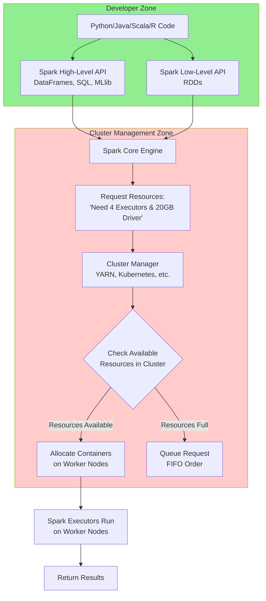

# 🚀 Demystifying the Apache Spark Ecosystem: What Happens When You Run Your Code?

Ever wonder what happens after you hit "run" on your Spark job? It's like ordering food delivery 🍕. You (the developer) place the order (your code). The **Spark Engine** is the kitchen that prepares it. The **Cluster Manager** is the delivery service that finds a bike and a route. And the **Cluster** is the network of roads and restaurants. This seamless coordination is the magic of the Spark Ecosystem.

Let's break down how these pieces fit together to process your data at scale.

---

## 🧩 Core Learning: The Spark Ecosystem Explained

### 1. The Spark Engine: The Heart of the Operation

At its core, Spark is a powerful **computational engine**. Its main job is to:

- Receive your data processing instructions.
- Break them down into parallelizable tasks.
- Distribute and manage the execution of those tasks across a cluster.
- It does **not** manage cluster resources itself—it relies on a cluster manager for that.

### 2. The APIs: How You Talk to Spark

Spark provides two main ways to interact with it:

- **High-Level APIs (The Easy Button):** These are the preferred way for most tasks. They are expressive and optimized.
    - **Spark SQL / DataFrames:** Lets you work with structured data using SQL-like queries or a DataFrame API. This is the most common API used today.
    - **Structured Streaming:** For processing real-time data streams.
    - **MLlib:** For machine learning algorithms.
- **Low-Level API (The Power User's Tool):** **Resilient Distributed Datasets (RDDs)**. This offers maximum control but is more complex. You'd only use RDDs for tasks that can't be expressed with the high-level APIs.

```python
# Example: High-Level API (DataFrames) vs. Low-Level API (RDDs)

# High-Level (Easy & Optimized)
df = spark.read.csv("data.csv")
result_df = df.filter(df["age"] > 25).groupBy("department").count()
result_df.show()

# Low-Level (More Control, More Complex)
rdd = spark.sparkContext.textFile("data.txt")
filtered_rdd = rdd.filter(lambda line: "error" in line.lower())
filtered_rdd.take(5) # Shows first 5 lines with "error"

```

### 3. Language Support: Code in Your Favorite Language

A key feature of Spark is its polyglot nature. You can write applications in:

- **Python (PySpark)**
- **Scala** (Spark's native language)
- **Java**
- **R**
Your code written in these languages is translated into operations that the core Spark engine (written in Scala) can execute.

### 4. The Cluster & Cluster Manager: The Hardware Brigade

- **Cluster:** A set of commodity machines (physical or virtual) connected over a network. These are the "workers" that provide the CPU and RAM.
- **Cluster Manager:** The "traffic cop" of the operation. Spark *requests* resources from it, but the manager is responsible for allocating them across the cluster. Popular options are:
    - **YARN** (Hadoop's resource manager, the most common in enterprises)
    - **Kubernetes** (the modern, cloud-native standard)
    - **Standalone** (Spark's built-in, simple cluster manager)
    - **Mesos** (less common now)

---

## 🔁 Visualizing the Spark Ecosystem

The diagram below shows the complete flow of how a Spark application gets resources and runs on a cluster.



---

## 🎯 Interview Edge: Key Questions Answered

**1. What is the role of the Cluster Manager in Spark?**

> Answer: The Cluster Manager (e.g., YARN, K8s) is an external service that allocates and manages resources (CPU, memory) across the cluster. Spark Engine negotiates with it for resources but doesn't manage them itself.
> 

**2. What is the difference between RDDs and DataFrames?**

> Answer: RDDs are a low-level API offering fine-grained control but require manual optimization. DataFrames are a high-level API built on RDDs that provide automatic optimization (Catalyst Optimizer) and are easier to use for structured data.
> 

**3. Can Spark run without Hadoop?**

> Answer: Yes. Spark only requires a cluster manager (like Kubernetes or its standalone mode) and a storage system (like S3, HDFS, or local disk). Hadoop (HDFS & YARN) is common but not mandatory.
> 

**4. Why is Spark considered a "computational engine"?**

> Answer: Because its primary focus is on processing data, not storing it or managing cluster resources. It's designed to perform computations fast, in memory, and in parallel, relying on other systems for storage and resource management.
> 

**5. What is the benefit of Spark's multi-language support?**

> Answer: It allows data engineers and scientists to use the language they are most productive in (Python, R, Scala, Java) while leveraging the same powerful distributed engine underneath, improving team efficiency.
> 

---

## ✅ Summary: The Big Picture

- Spark is a **unified analytics engine** for large-scale data processing.
- Its power comes from its **layered architecture**: easy-to-use APIs on top of a robust, optimized core engine.
- It's **flexible and polyglot**, supporting multiple languages and running on various cluster managers.
- Understanding the separation between the **Spark Engine** and the **Cluster Manager** is crucial for debugging and infrastructure planning.

Mastering Spark isn't just about writing code; it's about understanding this ecosystem to build efficient, scalable, and robust data pipelines.

**Keep learning, keep building!** 🚀

#ApacheSpark #BigData #DataEngineering #DistributedComputing #DataArchitecture #TechInterview #CareerGrowth

**👉 P.S. What's your preferred cluster manager for running Spark: YARN, Kubernetes, or something else? Share your experiences and why in the comments below! 👇**