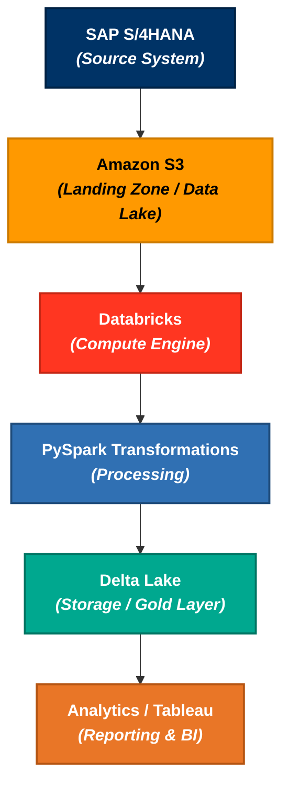
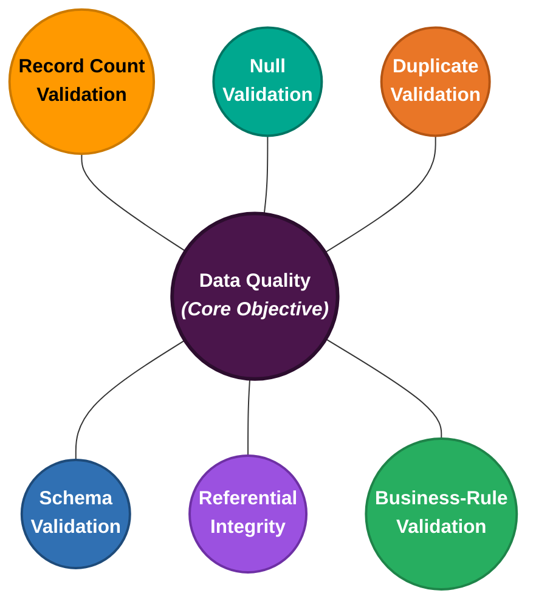

For **Data Engineering system design**, these three terms are the foundation.

> **Reliable = It works correctly.**
> 
> 
> **Scalable = It keeps working when data/users grow.**
> 
> **Maintainable = We can change and operate it without breaking everything.**
> 

Let's understand each from a **data pipeline perspective**, using a realistic example.

---

# 1. Reliable Applications

### Simple definition

A **reliable application** consistently produces the **correct result**, even when something goes wrong.

In Data Engineering, reliability means:

> "If my pipeline runs, can I trust the data it produces?"
> 

Imagine:



Suppose the Databricks job fails halfway through.

A reliable pipeline should **not leave your target table in a corrupted or partially processed state**.

### What makes a pipeline reliable?

#### 1. Fault tolerance

If one executor fails:

```
Task 1 → Success
Task 2 → Success
Task 3 → Executor failure
Task 4 → Success
```

Spark should be able to retry the failed task.

You shouldn't need to restart the entire pipeline manually.

---

#### 2. Idempotency

This is **very important in Data Engineering interviews**.

Suppose today's data contains:

```
Order ID | Amount
1001     | 500
1002     | 700
```

Your pipeline processes it successfully.

Then something happens and you rerun the pipeline.

A bad pipeline might produce:

```
1001 | 500
1002 | 700
1001 | 500
1002 | 700
```

A reliable pipeline should produce:

```
1001 | 500
1002 | 700
```

even after a retry.

That's **idempotency**.

Common techniques:

- MERGE
- Primary/business-key based deduplication
- `row_number()` based deduplication
- Checkpointing
- Watermarking
- Processing-date tracking

---

#### 3. Data quality

Reliability isn't just "the job succeeded."

This is a common misconception.

A pipeline can be:

```
Job status = SUCCESS
```

but:

```
10 million records expected
8 million records received
```

That's not reliable.

You therefore need checks such as:



---

#### 4. Recovery

Suppose your pipeline processes:

```
Day 1 → SUCCESS
Day 2 → SUCCESS
Day 3 → FAILED
Day 4 → SUCCESS
```

Can you recover Day 3 without unnecessarily reprocessing everything?

A reliable system should have:

- checkpoints
- retry mechanisms
- incremental processing
- error handling
- audit logs
- failure notifications

---

### Interview definition

You can say:

> **"Reliability means the data pipeline consistently produces correct and complete results despite failures. In Data Engineering, I achieve this using fault tolerance, retries, idempotent processing, data quality checks, checkpointing, and proper recovery mechanisms."**
> 

---

# 2. Scalable Applications

### Simple definition

A **scalable application** can handle increasing workload without the system becoming unusably slow or prohibitively expensive.

For Data Engineering:

> "What happens if my data grows from 1 TB to 10 TB or 100 TB?"
> 

Consider:

```
Today:
1 billion records

Tomorrow:
10 billion records

Next year:
50 billion records
```

A system designed only for today's volume may collapse.

---

# Horizontal vs Vertical Scaling

This is another important system-design concept.

### Vertical scaling

Make the machine bigger:

```
8 GB RAM
   ↓
32 GB RAM
   ↓
128 GB RAM
```

For example, moving to a larger Databricks worker.

The limitation is that there is eventually a hardware ceiling.

---

### Horizontal scaling

Add more machines:

```
           ┌── Worker 1
Driver ────┼── Worker 2
           ├── Worker 3
           ├── Worker 4
           └── Worker 5
```

Spark is designed heavily around horizontal scaling.

Instead of processing:

```
10 TB
```

on one machine, you distribute the workload across multiple executors.

---

# How do we make data pipelines scalable?

### 1. Distributed processing

Use:

- Spark
- PySpark
- Databricks

Instead of:

```python
pandas.read_csv("10TB.csv")
```

you use distributed processing:

```
S3
 ↓
Spark
 ↓
Multiple Executors
 ↓
Parallel Processing
```

---

### 2. Partitioning

Suppose you have:

```
10 billion transactions
```

Instead of scanning everything every day:

```
10 billion records
       ↓
      scan
```

partition by something appropriate:

```
year
  └── month
       └── day
```

Then today's query may only need:

```
2026/08/16
```

instead of scanning the entire dataset.

This is **partition pruning**.

---

### 3. Avoid unnecessary data movement

This is where your Spark knowledge becomes extremely relevant.

A massive shuffle:

```
Executor 1 ─────┐
Executor 2 ─────┤
Executor 3 ─────┼──→ Shuffle
Executor 4 ─────┤
Executor 5 ─────┘
```

can become a bottleneck.

So scalable Spark pipelines consider:

- partition strategy
- shuffle reduction
- broadcast joins where appropriate
- AQE
- skew handling
- predicate pushdown
- column pruning
- file sizing
- optimized joins

---

### 4. Incremental processing

Imagine your source contains:

```
100 billion records
```

and only:

```
20 million records
```

changed today.

A bad architecture:

```
100B → process everything
```

A scalable architecture:

```
20M changed records
        ↓
incremental processing
```

Technologies such as:

- Delta Change Data Feed
- CDC
- timestamps
- watermarks
- high-water marks

help achieve this.

---

### Interview definition

> **"Scalability means the system can handle increasing data volume, processing complexity, and workload without a linear degradation in performance. In Data Engineering, I achieve this through distributed processing, partitioning, incremental processing, efficient joins, shuffle optimization, and horizontal scaling."**
> 

---

# 3. Maintainable Applications

This one is often overlooked.

Imagine you have a pipeline with:

```
10,000 lines of PySpark
```

Everything works.

But nobody understands it except you.

Six months later:

> Business asks to add one column.
> 

Engineer changes one transformation.

Suddenly:

```
Pipeline A ❌
Pipeline B ❌
Pipeline C ❌
Dashboard ❌
```

That's a **maintainability problem**.

---

### Simple definition

A maintainable application is:

> **Easy to understand, modify, test, debug, and operate over time.**
> 

For Data Engineering, maintainability becomes extremely important because pipelines usually live for **years**, not weeks.

---

# How do we make pipelines maintainable?

### 1. Modular code

Instead of one massive notebook:

```
pipeline.py
```

with everything inside it:

```
Extract
Transform
Validate
Deduplicate
Load
Logging
Error handling
```

create reusable components:

```
extract()
transform()
validate()
deduplicate()
load()
```

---

### 2. Reusable utilities

Suppose you have 50 pipelines.

All of them need:

```
Add audit columns
Handle schema validation
Deduplicate records
Write Delta table
Log execution
```

Don't implement the same logic 50 times.

Create common utilities:

```
common/
 ├── logging.py
 ├── validation.py
 ├── delta_utils.py
 └── transformations.py
```

Now:

```
50 pipelines
      ↓
shared utilities
```

A bug fix can potentially benefit all pipelines.

---

### 3. Configuration-driven pipelines

Instead of hardcoding:

```python
source = "s3://nike-prod/acdoca/"
target = "prod.finance.acdoca"
```

use configuration:

```
environment = dev
source = ...
target = ...
partition_key = ...
```

Then:

```
DEV
QA
PROD
```

can use the same pipeline code with different configurations.

---

### 4. Observability

A maintainable data platform should make it easy to answer:

> "What happened?"
> 

You want:

```
Pipeline
   ↓
Started
   ↓
Records read
   ↓
Records transformed
   ↓
Records written
   ↓
Duration
   ↓
Status
```

And when it fails:

```
Pipeline failed
↓
Stage
↓
Task
↓
Error
↓
Root cause
```

Useful mechanisms include:

- structured logging
- metrics
- Spark UI
- audit tables
- alerts
- monitoring dashboards

---

### 5. Testing

Maintainable pipelines should be testable.

For example:

```
Unit tests
Integration tests
Data quality tests
Schema tests
Regression tests
```

Suppose you change a transformation.

You should be able to verify:

```
Old behavior → expected
New behavior → expected
```

without manually checking millions of records.

---

# Putting all three together

This is the most important part.

Imagine you're designing:

```
SAP S/4HANA
       ↓
      S3
       ↓
   Databricks
       ↓
    PySpark
       ↓
   Delta Lake
       ↓
   Analytics
```

You need all three dimensions:

| Principle | Question | Data Engineering Example |
| --- | --- | --- |
| **Reliable** | Can I trust it? | Idempotency, retries, DQ checks, recovery |
| **Scalable** | Can it handle 10× data? | Spark, partitioning, incremental processing |
| **Maintainable** | Can engineers change it safely? | Modular code, configs, testing, monitoring |

And they interact with each other.

```
                    DATA PLATFORM
                         │
          ┌──────────────┼──────────────┐
          ↓              ↓              ↓
      RELIABLE        SCALABLE      MAINTAINABLE
          │              │              │
       Correct        Large data      Easy changes
       Recoverable    Distributed     Modular
       Idempotent     Efficient       Testable
       Observable     Optimized        Observable
```

---

# A practical example

Suppose Nike's SAP source suddenly grows from:

**1B → 10B records**

### Reliable design

You need:

```
CDC/Incremental processing
+
Idempotent writes
+
Data quality checks
+
Retry/recovery
```

### Scalable design

You need:

```
Distributed Spark processing
+
Proper partitioning
+
Partition pruning
+
Efficient joins
+
AQE
+
Shuffle optimization
```

### Maintainable design

You need:

```
Reusable PySpark utilities
+
Configuration-driven pipelines
+
Automated testing
+
Logging
+
Monitoring
+
Documentation
```

That's essentially what **production-grade Data Engineering architecture** means.

---

# The mental model I want you to remember

When you get a **System Design question**, don't immediately jump to:

> "Which technology should I use?"
> 

Instead ask these three questions:

### 1️⃣ Reliable

**"What happens when something fails?"**

Think:

> Failure → Retry → Recovery → Correct result
> 

### 2️⃣ Scalable

**"What happens when data becomes 10× larger?"**

Think:

> Distributed processing → Partitioning → Parallelism → Incremental processing
> 

### 3️⃣ Maintainable

**"What happens when another engineer has to modify this six months later?"**

Think:

> Modular → Config-driven → Tested → Observable → Documented
> 

---

## One-line interview answer

If an interviewer asks **"What are the key characteristics of a good data system?"**, a strong answer is:

> **"I generally evaluate a data system across three dimensions: reliability, scalability, and maintainability. Reliability ensures the pipeline produces correct results and can recover from failures; scalability ensures it can handle growing data and workload efficiently; and maintainability ensures the system remains easy to modify, test, debug, and operate as requirements evolve."**
> 

This is a **foundation-level concept**. Once you have this mental model, topics like **Kafka, Spark, Databricks, Delta Lake, Airflow, CDC, partitioning, retries, checkpointing, observability, and data quality** become much easier to place in a system-design discussion.